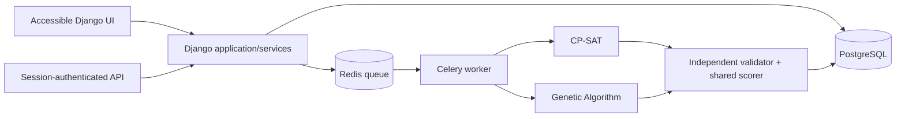

# USM Scheduler

<p align="center">
  
</p>

> **BSCS thesis prototype — not an official USM scheduling system.** The seal is
> shown for the proposed academic prototype and does not imply university
> endorsement. Institutional data, policy approval, deployment, and logo use
> require authorization from the responsible USM offices.

University-wide timetabling decision support for the University of Southern Mindanao (USM), developed for the BS Computer Science thesis:

> **A Comparative Evaluation of CP-SAT and Genetic Algorithm for University Timetabling and College-Boundary-Aware Room Assignment at the University of Southern Mindanao**

The system converts an authorized semester dataset into a frozen optimization problem, runs CP-SAT or a Genetic Algorithm (GA), validates every result independently, and keeps schedule approval with authorized university personnel. It is an optimization and experimental platform—not merely a CRUD timetable editor.

## What the system solves

The scheduler assigns each required class meeting to a time and authorized room while preserving USM academic rules.

Hard constraints include:

- no instructor, section, or room can be double-booked;
- each section and each scheduled meeting is limited to 50 students, including the
  combined enrollment of every unique section attached to a shared meeting;
- instructor and room unavailability must be respected;
- a meeting must occupy the required number of contiguous time atoms;
- laboratories and specialized meetings require compatible room capabilities;
- major subjects stay in rooms authorized for their college or academic unit;
- minor and general-education offerings follow the configured offering-unit authorization rules;
- repeated meetings marked for distinct days cannot fall on the same day; and
- active locked assignments are mandatory for both algorithms.

Soft objectives use one shared scorer for both algorithms: faculty time preference, section gaps, instructor gaps, and daily-load imbalance. Feasibility always takes priority over soft quality.

The 50-student rule is a fixed academic scheduling policy, not a physical-room
capacity model. All participating classrooms, laboratories, and special-purpose
rooms must be administratively approved for the baseline before import. Variable
room capacities, chair counts, floor area, walking-distance optimization, and an
AI chatbot as the scheduling engine remain out of scope. Student records are
optional and pseudonymous; the solver operates on section membership and frozen
section headcounts, not student identity.

## Architecture at a glance



- **Frontend:** server-rendered, responsive Django templates with custom CSS and small vanilla-JavaScript enhancements. Core pages remain readable without JavaScript.
- **Application:** Django 5.2, Django REST Framework, service-layer orchestration, and role-scoped administration.
- **Optimization:** OR-Tools CP-SAT plus a project-owned GA over the same immutable `ProblemSnapshot` contract.
- **Async execution:** Celery workers with Redis; development can run tasks eagerly.
- **Persistence:** PostgreSQL 18 in Compose/production, SQLite as a low-friction local fallback.
- **Deployment:** Gunicorn and WhiteNoise in an unprivileged container; separate web and solver worker processes.

See [Architecture](docs/architecture.md) for component boundaries and data flows.

## Try the complete synthetic workflow

After the local-development setup below, create safe demo accounts and a small
starter term:

```powershell
python manage.py seed_demo `
  --admin-password "AdminPassword123!" `
  --central-password "SchedulerPassword123!" `
  --reviewer-password "ReviewerPassword123!"
python manage.py runserver
```

Open <http://127.0.0.1:8000/accounts/login/> and sign in as
`demo-scheduler` / `SchedulerPassword123!`. From **Data import**, download the
schema 1.1 synthetic trial workbook after choosing its target term, preview it
against that same term, commit the clean revision, then use **Generate schedule**
to run CP-SAT and GA. Its policy hashes come from approved versions already
stored for that term; downloading never approves a policy. The tracked
[v1 workbook](examples/USM-Scheduler-Synthetic-Trial-v1.xlsx) is retained only as
a legacy exploratory fixture and must not be used for the thesis-v2 pilot.

The richer workbook contains 14 meetings, five sections, 11 offerings, two
laboratories, restricted availability, a shared offering, team teaching,
explicit cross-unit room grants, a distinct-day pair, one lock, enrollment up to
the fixed limit of 50, instructor daily limits, and a recurring reserved block. It contains
no student rows and all names/codes are visibly synthetic. Automated tests prove
that the same workbook imports, preflights, and yields independently feasible
results from both engines.

## Quick start with Docker Compose

Requirements: Docker Engine with Compose v2.

1. Create a local environment file and replace the example secrets:

   ```powershell
   Copy-Item .env.example .env
   ```

2. Start PostgreSQL, Redis, the Django web process, and the Celery worker:

   ```powershell
   docker compose up --build -d
   ```

3. Create the first administrator:

   ```powershell
   docker compose exec web python manage.py createsuperuser
   ```

4. Open <http://localhost:8000/>. Health status is available at <http://localhost:8000/healthz/>.

Inspect or stop the stack with:

```powershell
docker compose logs -f web worker
docker compose down
```

`docker compose down` preserves named database and media volumes. Adding `--volumes` permanently deletes those local volumes; use it only when a clean reset is intentional.

The Compose defaults are for local evaluation. Before any institutional deployment, set `DJANGO_DEBUG=false`, use a strong `DJANGO_SECRET_KEY` and `POSTGRES_PASSWORD`, use HTTPS, set exact allowed hosts/origins, and arrange backups. Set `APP_BUILD_ID`, `SOURCE_COMMIT`, and `CONTAINER_IMAGE_ID` to the deployed build's durable identifiers so experiment manifests can identify the exact source/image. Behind a verified HTTPS reverse proxy, enable `DJANGO_SECURE_SSL_REDIRECT`; set HSTS only after confirming the entire selected domain is permanently HTTPS-only.

## Local development without Docker

Python 3.12 is recommended.

```powershell
py -3.12 -m venv .venv
.\.venv\Scripts\Activate.ps1
python -m pip install --upgrade pip
python -m pip install --require-hashes --only-binary=:all: -r requirements-hashed.txt
python -m pip install -r requirements-dev.txt
python -m playwright install --no-shell chromium
$env:CELERY_TASK_ALWAYS_EAGER = 'true'
python manage.py migrate
python manage.py createsuperuser
python manage.py runserver
```

When `POSTGRES_HOST` is unset, Django uses a local untracked SQLite database. Solver tasks run eagerly when `CELERY_TASK_ALWAYS_EAGER=true`; use Redis and `celery -A usm_scheduler worker --loglevel=INFO` to exercise the real queue.

Configuration is read from environment variables; the application does not automatically load `.env`. Docker Compose loads `.env` for interpolation. Key variables are documented in `.env.example`.

## Semester workflow

1. **Configure:** create colleges, departments, programs, curricula, rooms/capabilities, instructors, and an academic term.
2. **Stage:** upload only USM-authorized semester records. Import errors remain outside committed solver data.
3. **Commit:** validate and hash a `TermDatasetRevision`. Committed revisions are immutable.
4. **Snapshot:** build an immutable `ProblemSnapshot` using an approved, versioned objective profile.
5. **Run:** queue CP-SAT and GA with recorded seeds, time limits, and solver configuration. Formal experiments preserve each CP-SAT/GA scale-and-seed block as a deterministic comparison pair while recognizing that the engines transform their random streams differently.
6. **Validate:** run the algorithm-independent validator and shared scorer. An invalid result cannot be promoted as feasible.
7. **Review:** promote a result to a versioned timetable, collect college endorsements or change requests, lock accepted meetings if needed, and regenerate a child version.
8. **Approve:** a central scheduler or system administrator may approve only an independently validated feasible schedule. Approved versions are immutable and remain auditable.

If the current hard requirements are infeasible, the system reports that condition. It never silently relaxes a college boundary, availability rule, conflict rule, or lock.

## Algorithm comparison

Both solvers consume the same domain contract and candidate placements. Candidate generation already removes illegal room, availability, duration, authorization, and lock choices. CP-SAT enforces cross-event constraints exactly. GA ranks hard violations lexicographically before the shared soft penalty and returns its best result; the independent validator—not the solver’s own claim—determines feasibility.

For thesis results, do not compare ad hoc UI runs. Use controlled experiment batches with the same snapshot, objective-profile hash, seed list, time limit, CPU allocation, and machine. Record failures and timeouts rather than dropping them. The complete preregistration-ready procedure and metric definitions are in [Experiment protocol](docs/experiment-protocol.md).

Research runs have two explicitly different purposes:

- **Exploratory analysis** supports development, synthetic tuning, diagnostics,
  and configurable trial batches. It can suggest improvements but cannot declare
  the thesis winner.
- **Formal thesis study** freezes the authorized source snapshot, approved rule
  and objective manifests, solver profiles, environment, and protocol before
  results are inspected. It evaluates nested 25%, 50%, 75%, and 100% demand
  instances with the three primary outcomes: feasible-generation rate, common
  feasible-schedule penalty, and censor-aware time to feasibility.

CP-SAT and GA receive equal synthetic tuning budgets before their profiles are
frozen: seeds `2001–2005`, six configurations per algorithm, and 60 seconds per
configuration/seed, for a maximum allocated tuning time of 30 minutes per
algorithm. The formal matrix then uses seeds `1001–1030` at each nested scale.
Its preregistered analysis retains deterministic CP-SAT/GA seed blocks for the
paired feasibility and time-to-feasibility comparisons; feasible-only quality
uses the declared deterministic label-permutation comparison and effect size.
Formal conclusions require a complete, protocol-valid 100% study. An
incomplete, exploratory, cancelled, or provenance-invalid study must report that
no formal conclusion is available.

## Roles and review authority

- **System administrator:** platform configuration, account management, and emergency administration.
- **Central scheduler:** semester datasets, experiments, schedule versioning, locks, and final approval.
- **College reviewer:** review and endorsement/change requests only for colleges in the user’s assigned scope.

Django sessions and CSRF protection secure browser actions. Audit events are append-only. Source files, database dumps, workbooks, and experiment outputs are ignored by Git; never commit institutional research data.

## Verification

`requirements-lock.txt` is the reviewed exact runtime closure.
`requirements-hashed.txt` contains the same versions and published artifact
SHA-256 hashes; CI and Docker enforce it with `--require-hashes` and binary-only
installs. Regenerate hashes after an approved dependency change using
`uv pip compile requirements-lock.txt --generate-hashes --no-deps --no-header --no-annotate --output-file requirements-hashed.txt`.
The lock parity test prevents silently changing versions while regenerating hashes.

```powershell
ruff check .
python manage.py check
python manage.py makemigrations --check --dry-run
python -m pip_audit --requirement requirements-lock.txt --no-deps --disable-pip
pytest
```

The complete suite includes a headless Chromium login/import smoke path. Install the browser once with `python -m playwright install --no-shell chromium`; Linux CI adds `--with-deps`.

CI repeats dependency consistency and vulnerability checks, linting, Django
checks, migrations, static collection, tests with coverage, and a clean
container build against PostgreSQL and Redis.

Useful targeted commands:

```powershell
pytest tests\optimization
pytest tests\test_models.py
pytest tests\test_statistics.py
```

Useful safe management commands:

```powershell
# Create a synthetic, de-identified demonstration term and unusable-password users.
python manage.py seed_demo

# Write only the public XLSX schema/template (never institutional data).
python manage.py create_import_template .\usm-semester-template.xlsx

# Generate a policy-bound synthetic v2 workbook for the seeded term ID.
python manage.py create_trial_workbook `
  --term-id 1 --output .\USM-Scheduler-Synthetic-Trial-v2.xlsx

# Clone a committed semester into an editable draft.
python manage.py clone_term 1 --academic-year 2027-2028 --semester FIRST `
  --starts-on 2027-08-01 --ends-on 2027-12-20 --actor central-scheduler

# Preview a scaling plan; database writes require the explicit --commit flag.
python manage.py create_scaling_snapshots 1

# Preview the 60-run comparison; execution requires --mode direct or --mode queue.
python manage.py run_comparison_experiment 1

# Preview the equal-budget six-configuration × five-seed pilot for both engines.
python manage.py solver_tuning_grid 1

# Explicitly attest synthetic data before allocating the excluded pilot budget.
python manage.py solver_tuning_grid 1 --mode queue --user-id 1 --confirm-synthetic
```

For fast, database-free algorithm development checks on wholly synthetic
fixtures, run:

```powershell
python scripts/benchmark_ga.py --output experiment-results/ga-development.json --seconds 3 --seeds 5001 5002 5003 5004 5005
```

The diagnostic saves the source, problem snapshots, independently validated
results, and environment hashes. Use `--solver-source path/to/saved/genetic.py`
to replay an earlier implementation under the same harness. This shortened
diagnostic does not select formal solver profiles or replace the equal-budget
CP-SAT/GA pilot.

See the [GA-v5 development report](docs/algorithm-tuning-ga-v5.md) for staged
comparisons, five-seed validation, limitations, and reproduction commands. The
[earlier GA-v4 report](docs/algorithm-tuning-2026-08-30.md) remains historical.

GA-v5 adds prepared evaluation, capped repair, and a feasible-schedule improvement
pass. Compare saved implementations sequentially with checkpoints:

```powershell
python scripts/compare_ga.py --output experiment-results/ga-comparison --source ga-v4=experiment-results/ga-v5/baseline/genetic.py --source ga-v5=scheduler/solvers/genetic.py --budgets 3 10 30 --seeds 5001 5002 5003 5004 5005
```

Saved source paths must exist and be trusted. Completed observations are reused
only when source, harness, environment, and execution settings match. Use
`--cases unseen_dense unseen_daily` for the two additional synthetic variants.
These diagnostics never access the database or freeze formal profiles.
Use `scripts/report_ga_comparison.py <comparison-directory> --output <report.json>`
to independently revalidate saved results and create paired summaries; the
report rejects incomplete, mismatched, duplicate, or profiled observations.

The web workspace exposes the corresponding import, clone/finalize, preflight, run,
experiment, review, lock/regenerate, approval, and export workflows. A cloned term
remains a draft until its objective profile is approved and its full preflight is
atomically committed.

## Repository map

```text
scheduler/
  domain/       immutable problem contracts, common validation, and scoring
  solvers/      CP-SAT and Genetic Algorithm implementations
  services/     ORM-to-problem builder, run orchestration, and statistics
  api/          authenticated HTTP interfaces
  templates/    accessible scheduling workspace
  static/       project-owned CSS and JavaScript
docs/           concept paper, guidebook, architecture, experiment, and defense notes
examples/       one explicitly identified synthetic XLSX trial dataset
scripts/        reproducible concept-paper and Word-document builders
docker/         container entrypoint
usm_scheduler/  Django, Celery, ASGI, and WSGI configuration
tests/          model, service, statistical, and solver verification
```

## Project documentation

- [Printable Word user guide](docs/USM-Scheduler-User-Guide.docx)
- [Markdown user guide](docs/user-guide.md)
- [Printable Word concept paper](docs/USM-Scheduler-Concept-Paper.docx)
- [Self-contained HTML concept paper](docs/USM-Scheduler-Concept-Paper.html)
- [Markdown concept paper](docs/concept-paper.md)
- [USM Kabacan research and prioritized gap assessment](docs/usm-kabacan-research-and-gap-assessment.md)
- [Complete system development plan](docs/system-plan.md)
- [System architecture](docs/architecture.md)
- [Data dictionary](docs/data-dictionary.md)
- [Controlled experiment protocol](docs/experiment-protocol.md)
- [Development and acceptance roadmap](docs/development-roadmap.md)
- [Thesis defense notes](docs/thesis-defense.md)
- [Thesis validation report](docs/thesis-validation-report.md)
- [Usability validation kit](docs/usability-test-kit.md)

## Latest reliability audit

The [September 5 audit](docs/audit-2026-09-05.md) covers review history, PostgreSQL
locking, timetable accuracy, dependency security, and GA-v6 development validation.
The current solver identifiers are GA-v6 and CP-SAT-v4; earlier tuning reports
remain historical. Rerun the registered equal-budget pilot before freezing profiles
for the new build.

## Research and operational limits

- Conclusions apply to the authorized USM terms and instance sizes actually evaluated; “university-wide” describes the system boundary, not automatic statistical generalization to every university.
- Room-time utilization means occupied usable room-time atoms divided by available room-time atoms. It is never chair, seat, floor-space, or physical-capacity utilization; the separate fixed 50-student scheduling rule applies uniformly to every participating room type.
- Solver output reflects the encoded data. Missing or incorrect authorization and availability records can make a real schedule appear infeasible; import validation and administrative review remain essential.
- Schedule quality depends on a versioned weighting policy. Report sensitivity analyses and never change objective weights after inspecting final algorithm results.
- This prototype supports scheduling decisions. Authorized USM personnel retain responsibility for policy exceptions, publication, and final use.
