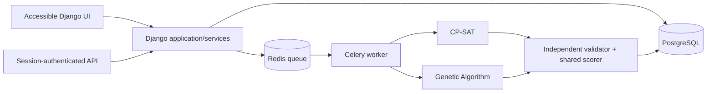

# USM Scheduler

University-wide timetabling decision support for the University of Southern Mindanao (USM), developed for the BS Computer Science thesis:

> **A Comparative Evaluation of CP-SAT and Genetic Algorithm for University Timetabling and College-Boundary-Aware Room Assignment at the University of Southern Mindanao**

The system converts an authorized semester dataset into a frozen optimization problem, runs CP-SAT or a Genetic Algorithm (GA), validates every result independently, and keeps schedule approval with authorized university personnel. It is an optimization and experimental platform—not merely a CRUD timetable editor.

## What the system solves

The scheduler assigns each required class meeting to a time and authorized room while preserving USM academic rules.

Hard constraints include:

- no instructor, section, or room can be double-booked;
- instructor and room unavailability must be respected;
- a meeting must occupy the required number of contiguous time atoms;
- laboratories and specialized meetings require compatible room capabilities;
- major subjects stay in rooms authorized for their college or academic unit;
- minor and general-education offerings follow the configured offering-unit authorization rules;
- repeated meetings marked for distinct days cannot fall on the same day; and
- active locked assignments are mandatory for both algorithms.

Soft objectives use one shared scorer for both algorithms: faculty time preference, section gaps, instructor gaps, and daily-load imbalance. Feasibility always takes priority over soft quality.

Out of scope for the thesis baseline: walking-distance optimization, seat/chair-capacity optimization, and an AI chatbot as the scheduling engine. Student records are optional and pseudonymous; the solver operates on section membership, not student identity.

## Architecture at a glance



- **Frontend:** server-rendered, responsive Django templates with custom CSS and small vanilla-JavaScript enhancements. Core pages remain readable without JavaScript.
- **Application:** Django 5.2, Django REST Framework, service-layer orchestration, and role-scoped administration.
- **Optimization:** OR-Tools CP-SAT plus a project-owned GA over the same immutable `ProblemSnapshot` contract.
- **Async execution:** Celery workers with Redis; development can run tasks eagerly.
- **Persistence:** PostgreSQL 18 in Compose/production, SQLite as a low-friction local fallback.
- **Deployment:** Gunicorn and WhiteNoise in an unprivileged container; separate web and solver worker processes.

See [Architecture](docs/architecture.md) for component boundaries and data flows.

## Quick start with Docker Compose

Requirements: Docker Engine with Compose v2.

1. Create a local environment file and replace the example secrets:

   ```powershell
   Copy-Item .env.example .env
   ```

2. Start PostgreSQL, Redis, the Django web process, and the Celery worker:

   ```powershell
   docker compose up --build -d
   ```

3. Create the first administrator:

   ```powershell
   docker compose exec web python manage.py createsuperuser
   ```

4. Open <http://localhost:8000/>. Health status is available at <http://localhost:8000/healthz/>.

Inspect or stop the stack with:

```powershell
docker compose logs -f web worker
docker compose down
```

`docker compose down` preserves named database and media volumes. Adding `--volumes` permanently deletes those local volumes; use it only when a clean reset is intentional.

The Compose defaults are for local evaluation. Before any institutional deployment, set `DJANGO_DEBUG=false`, use a strong `DJANGO_SECRET_KEY` and `POSTGRES_PASSWORD`, use HTTPS, set exact allowed hosts/origins, and arrange backups. Set `APP_BUILD_ID`, `SOURCE_COMMIT`, and `CONTAINER_IMAGE_ID` to the deployed build's durable identifiers so experiment manifests can identify the exact source/image. Behind a verified HTTPS reverse proxy, enable `DJANGO_SECURE_SSL_REDIRECT`; set HSTS only after confirming the entire selected domain is permanently HTTPS-only.

## Local development without Docker

Python 3.12 is recommended.

```powershell
py -3.12 -m venv .venv
.\.venv\Scripts\Activate.ps1
python -m pip install --upgrade pip
python -m pip install -r requirements-dev.txt
python -m playwright install --no-shell chromium
$env:CELERY_TASK_ALWAYS_EAGER = 'true'
python manage.py migrate
python manage.py createsuperuser
python manage.py runserver
```

When `POSTGRES_HOST` is unset, Django uses a local untracked SQLite database. Solver tasks run eagerly when `CELERY_TASK_ALWAYS_EAGER=true`; use Redis and `celery -A usm_scheduler worker --loglevel=INFO` to exercise the real queue.

Configuration is read from environment variables; the application does not automatically load `.env`. Docker Compose loads `.env` for interpolation. Key variables are documented in `.env.example`.

## Semester workflow

1. **Configure:** create colleges, departments, programs, curricula, rooms/capabilities, instructors, and an academic term.
2. **Stage:** upload only USM-authorized semester records. Import errors remain outside committed solver data.
3. **Commit:** validate and hash a `TermDatasetRevision`. Committed revisions are immutable.
4. **Snapshot:** build an immutable `ProblemSnapshot` using an approved, versioned objective profile.
5. **Run:** queue CP-SAT and GA with recorded seeds, time limits, and solver configuration. Controlled experiments run both algorithms on the same snapshot without treating common seed numbers as statistical pairs.
6. **Validate:** run the algorithm-independent validator and shared scorer. An invalid result cannot be promoted as feasible.
7. **Review:** promote a result to a versioned timetable, collect college endorsements or change requests, lock accepted meetings if needed, and regenerate a child version.
8. **Approve:** a central scheduler or system administrator may approve only an independently validated feasible schedule. Approved versions are immutable and remain auditable.

If the current hard requirements are infeasible, the system reports that condition. It never silently relaxes a college boundary, availability rule, conflict rule, or lock.

## Algorithm comparison

Both solvers consume the same domain contract and candidate placements. Candidate generation already removes illegal room, availability, duration, authorization, and lock choices. CP-SAT enforces cross-event constraints exactly. GA ranks hard violations lexicographically before the shared soft penalty and returns its best result; the independent validator—not the solver’s own claim—determines feasibility.

For thesis results, do not compare ad hoc UI runs. Use controlled experiment batches with the same snapshot, objective-profile hash, seed list, time limit, CPU allocation, and machine. Record failures and timeouts rather than dropping them. The complete preregistration-ready procedure and metric definitions are in [Experiment protocol](docs/experiment-protocol.md).

## Roles and review authority

- **System administrator:** platform configuration, account management, and emergency administration.
- **Central scheduler:** semester datasets, experiments, schedule versioning, locks, and final approval.
- **College reviewer:** review and endorsement/change requests only for colleges in the user’s assigned scope.

Django sessions and CSRF protection secure browser actions. Audit events are append-only. Source files, database dumps, workbooks, and experiment outputs are ignored by Git; never commit institutional research data.

## Verification

```powershell
ruff check .
python manage.py check
python manage.py makemigrations --check --dry-run
pytest
```

The complete suite includes a headless Chromium login/import smoke path. Install the browser once with `python -m playwright install --no-shell chromium`; Linux CI adds `--with-deps`.

CI repeats linting, Django checks, migrations, static collection, tests with coverage, and a clean container build against PostgreSQL and Redis.

Useful targeted commands:

```powershell
pytest tests\optimization
pytest tests\test_models.py
pytest tests\test_statistics.py
```

Useful safe management commands:

```powershell
# Create a synthetic, de-identified demonstration term and unusable-password users.
python manage.py seed_demo

# Write only the public XLSX schema/template (never institutional data).
python manage.py create_import_template .\usm-semester-template.xlsx

# Clone a committed semester into an editable draft.
python manage.py clone_term 1 --academic-year 2027-2028 --semester FIRST `
  --starts-on 2027-08-01 --ends-on 2027-12-20 --actor central-scheduler

# Preview a scaling plan; database writes require the explicit --commit flag.
python manage.py create_scaling_snapshots 1

# Preview the 60-run comparison; execution requires --mode direct or --mode queue.
python manage.py run_comparison_experiment 1

# Preview the fixed 24-configuration × 10-seed synthetic GA pilot grid.
python manage.py ga_tuning_grid 1
```

The web workspace exposes the corresponding import, clone/finalize, preflight, run,
experiment, review, lock/regenerate, approval, and export workflows. A cloned term
remains a draft until its objective profile is approved and its full preflight is
atomically committed.

## Repository map

```text
scheduler/
  domain/       immutable problem contracts, common validation, and scoring
  solvers/      CP-SAT and Genetic Algorithm implementations
  services/     ORM-to-problem builder, run orchestration, and statistics
  api/          authenticated HTTP interfaces
  templates/    accessible scheduling workspace
  static/       project-owned CSS and JavaScript
docs/           architecture, schema, experiment, roadmap, and defense notes
docker/         container entrypoint
usm_scheduler/  Django, Celery, ASGI, and WSGI configuration
tests/          model, service, statistical, and solver verification
```

## Project documentation

- [Complete system development plan](docs/system-plan.md)
- [System architecture](docs/architecture.md)
- [Data dictionary](docs/data-dictionary.md)
- [Controlled experiment protocol](docs/experiment-protocol.md)
- [Development and acceptance roadmap](docs/development-roadmap.md)
- [Thesis defense notes](docs/thesis-defense.md)

## Research and operational limits

- Conclusions apply to the authorized USM terms and instance sizes actually evaluated; “university-wide” describes the system boundary, not automatic statistical generalization to every university.
- Room utilization means occupied usable room-time atoms divided by available room-time atoms. It is not seat utilization because capacity optimization is excluded.
- Solver output reflects the encoded data. Missing or incorrect authorization and availability records can make a real schedule appear infeasible; import validation and administrative review remain essential.
- Schedule quality depends on a versioned weighting policy. Report sensitivity analyses and never change objective weights after inspecting final algorithm results.
- This prototype supports scheduling decisions. Authorized USM personnel retain responsibility for policy exceptions, publication, and final use.
