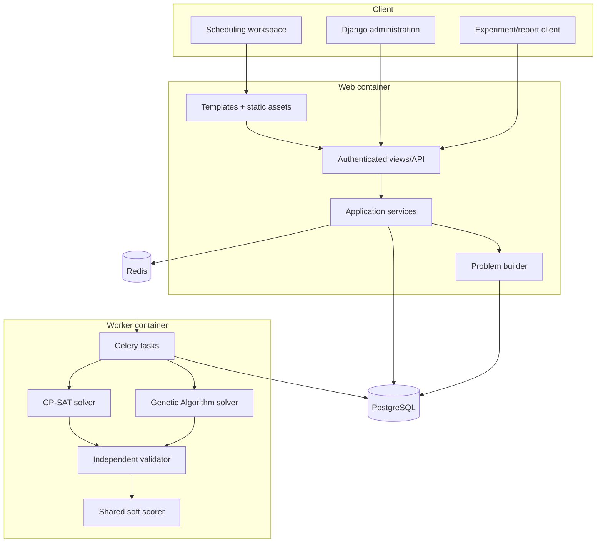
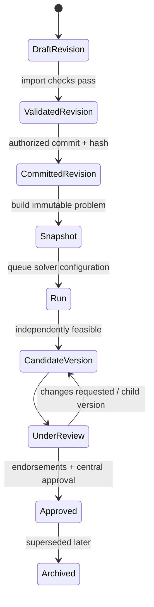

# System architecture

## Architectural intent

USM Scheduler separates institutional data, immutable research inputs, optimization, independent validation, and human approval. This makes operational scheduling safer and the CP-SAT/GA comparison reproducible.

The core rule is: **both algorithms receive the same frozen problem and neither algorithm validates itself.**

## Component model



### Presentation

The browser interface is server rendered for simple deployment and strong default accessibility. JavaScript adds navigation, table filtering, file-drop behavior, and asynchronous form hooks; it does not contain scheduling rules. Templates consume view-specific adapters so presentation does not depend directly on every model field.

HTML views resolve domain models at request time. This keeps the delivery shell usable during schema evolution and allows empty-state rendering before the database is initialized. The public `/healthz/` endpoint executes `SELECT 1`; container health therefore represents both web and database readiness.

### Application and API

Django owns authentication, role-scoped administration, transaction boundaries, dataset/version lifecycle, review workflow, and persistence. Django REST Framework is the intended interface for imports, runs, reviews, and reporting integrations. Browser mutations use session authentication plus CSRF protection.

Views must not construct solver variables or calculate feasibility. They call application services or queue tasks and render persisted state. Services are responsible for authorization, transactions, audit logging, and legal state transitions.

### Data preparation

The builder converts one committed `TermDatasetRevision` plus one approved `ObjectiveProfile` into a `ProblemSnapshot`:

1. load active offerings, sections, instructors, meeting requirements, time atoms, rooms, capabilities, authorization, availability, and locks from one revision;
2. reject incomplete availability profiles unless an authorized user explicitly acknowledged the “fully available” assumption;
3. enumerate only legal candidate placements for each meeting;
4. fail before solving if a meeting has no legal candidate;
5. serialize the problem and candidate map canonically; and
6. hash and persist the immutable snapshot.

Candidate legality includes campus, contiguous duration, breaks, room
availability, room capabilities, unit authorization, approved recurring blocks,
and active locks. The builder freezes each section headcount and the sum of
unique attached sections for every meeting. A section or meeting above the fixed
50-student maximum blocks snapshot creation uniformly for every room type; no
room-capacity, chair, or floor-space value enters the candidate map. Cross-event
instructor/section/room conflicts, distinct-day groups, and instructor daily-load
limits remain solver constraints.

### Optimization boundary

Both solvers implement the same conceptual interface:

```python
result = Solver(problem, config).solve()
```

The input is an immutable `ProblemInstance`; output is a `SolverResult` containing algorithm, status, assignments, objective, validation, runtime, time to first feasible, stopping reason, metrics, seed, and hashes.

- **CP-SAT:** one Boolean selection variable for each legal event/candidate pair; exactly one placement per event; at-most-one occupation for each room, instructor, and section time atom; distinct-day and approved instructor daily-load constraints; weighted soft penalty minimized. CP-SAT may prove optimality or infeasibility.
- **GA:** one gene per meeting whose allele indexes that meeting’s legal candidates; seeded population; tournament selection, crossover, mutation, elitism, and repair/local improvement; lexicographic fitness prioritizes hard-violation count before the identical soft penalty. GA may find a feasible result but must not claim proof of optimality or infeasibility.

The `ga-v5` constructor seeds locked occupancy and instructor teaching loads,
then ranks placements by new hard conflicts, additional daily-limit excess, and
weighted faculty preference. A zero preference weight removes that construction
bias. Non-room conflict costs are reused across room alternatives at the same
time, and a zero-cost placement ends the shuffled candidate scan early. The
independent validator and shared objective scorer still assess every evaluated
chromosome; these heuristics do not replace frozen policy checks.

When single-meeting repair cannot reduce hard violations, a bounded two-move search retains up to four
intermediate moves that do not increase the hard-violation count and tries moving
another implicated, unlocked meeting. It adopts only a strict improvement in
the common hard-first fitness. Each repair call permits at most 128 evaluation
requests, including cache hits: 96 single-state requests (including the initial
state) and 32 coordinated-move requests. Round-robin scans distribute work across
implicated meetings and the four retained intermediate states, with actual
blockers prioritized. The existing time and repair-attempt limits also apply.
Diagnostic counters report the evaluations, budget exhaustion, completed
offspring, and improvements. These fixed
implementation limits are not extra pilot configurations. Any changed solver
build requires a fresh excluded pilot before formal profiles can be frozen.

After a full generation completes, the best feasible incumbent receives at most
64 additional single-move/swap trials within the same deadline. A proposal is
adopted only if it remains independently feasible and strictly lowers the shared
objective. Locked meetings are excluded from both ends of swaps.

`PreparedProblem` stores immutable candidate lookup and time-position indexes
bound by identity to one problem. `validate_schedule`, `score_schedule`, and
`resolve_assignments` accept it through an optional keyword-only `prepared`
argument; existing callers, including CP-SAT, retain the unprepared path. Every
raw policy check still runs. Preparation is inside the GA deadline and can time
out; partial contexts never escape. Each prospective GA incumbent is rechecked
without prepared indexes before deadline-qualified acceptance.

Clock-dependent preparation, initialization, validation, scoring, repair, and
feasible-improvement timings are emitted only for diagnostic traces. They overlap
(for example, repair includes validation/scoring), while deterministic work
counters remain available on ordinary runs.

The worker persists lifecycle timestamps and result data. Long optimization never runs inside an HTTP request.

### Independent validation and scoring

Every result passes through the same algorithm-independent validator. It verifies
completeness, candidate membership, locks, room conflicts, instructor conflicts,
section conflicts, distinct-day rules, reserved teaching blocks, instructor
daily-load limits, and the frozen 50-student meeting maximum. Conflict counting
uses a unique resource/event-pair key, so one collision spanning multiple time
atoms is counted once.

Only a zero-hard-violation result is feasible. The shared scorer then calculates faculty-preference penalty, internal section gaps, internal instructor gaps, daily-load imbalance, weighted penalty, and normalized 0–100 quality. A persisted validation result records validator version and breakdown.

### Versioning, review, and approval



Committed/superseded dataset revisions, approved objective profiles, problem snapshots, approved/archived schedules, and audit events are immutable. Changes create a new revision or child schedule. Locks are explicit hard preassignments and are included in subsequent snapshots.

College reviewers are limited by `UserCollegeScope`. An endorsement or change request requires a comment. Only a central scheduler or system administrator can issue final approval, and only for an independently validated feasible schedule.

## Data flow by use case

### Import a semester

`Workbook → ImportBatch → ImportError/preview → TermDatasetRevision → canonical content hash → commit`

Invalid imports remain staged. File hashes prevent accidentally importing the same workbook twice for one term. Original workbooks belong in protected media storage and must not enter Git.

### Generate a schedule

`Committed revision + objective profile → ProblemSnapshot → ScheduleRun(QUEUED) → Celery → solver → validator/scorer → terminal ScheduleRun`

Infrastructure failure is `FAILED`; an exhausted search without a feasible result is `NO_SOLUTION` or `TIMEOUT`; only CP-SAT may report proven `INFEASIBLE` or `OPTIMAL`.

### Publish a timetable

`Feasible run → ScheduleVersion(DRAFT) → assignments/atom allocations → ValidationResult → UNDER_REVIEW → college reviews → APPROVED`

Atom-allocation tables reinforce uniqueness at the database layer for rooms, instructors, and sections in every schedule version.

## Deployment topology

Docker Compose runs four services:

| Service | Responsibility | Durable state |
|---|---|---|
| `web` | Gunicorn, Django views/API, static delivery | shared media/static volumes |
| `worker` | Celery optimization and reporting work | shared media; results in PostgreSQL |
| `db` | PostgreSQL source of truth | `postgres_data` |
| `redis` | task broker/result transport | `redis_data` |

Web and worker use the same unprivileged image, a read-only root filesystem, a writable temporary filesystem, no added Linux capabilities, and `no-new-privileges`. Only web applies migrations and collects static files. Database and Redis are not published to host ports by default.

For production, use managed PostgreSQL/Redis where possible, object storage or an encrypted protected volume for authorized workbooks, TLS at a trusted reverse proxy, centralized logs, database backups with restore tests, and institution-approved retention controls.

## Failure modes and safe behavior

| Condition | Required behavior |
|---|---|
| Invalid/missing import reference | reject commit and show row-level errors |
| No legal candidate for a meeting | fail snapshot build with diagnostic; do not start solver |
| Conflicting active locks | diagnose infeasibility; never relax locks silently |
| Solver timeout | preserve best independently validated result, deadline, and stopping reason |
| Worker crash | mark/reconcile stale running task; preserve immutable input and task ID |
| Database unavailable | `/healthz/` returns 503; container stops receiving traffic |
| Review requests changes | create a child schedule or new run; never edit approved content |
| Missing preference data | use zero preference penalty and disclose unavailable soft measure |

## Security and privacy boundaries

- Store only pseudonymous student codes if student membership is required; names and student numbers are not solver inputs.
- Apply least privilege using the three user roles plus college scope.
- Protect mutations with authentication, CSRF, service authorization, and append-only audit events.
- Do not log workbook contents, passwords, access tokens, or direct identifiers.
- Treat hashes as integrity/reproducibility identifiers, not anonymization.
- Keep research extracts and results outside source control; publish only adviser/USM-approved de-identified artifacts.

## Integration contracts

The delivery templates expose conventional action points for run creation, import submission, and review updates under `/api/v1/`. Application endpoints must validate role, state transition, CSRF/authentication, and idempotency before invoking services. UI adapters tolerate absent rows, but APIs must return explicit 4xx validation errors rather than silently coercing invalid institutional data.

Backward compatibility policy for the prototype:

- version serialized problem contracts with `schema_version`;
- preserve committed database migrations;
- never rewrite historical snapshot or objective-profile hashes;
- add soft objectives with versioned definitions and normalization; and
- require a migration/rebuild path when a hard-rule interpretation changes.
