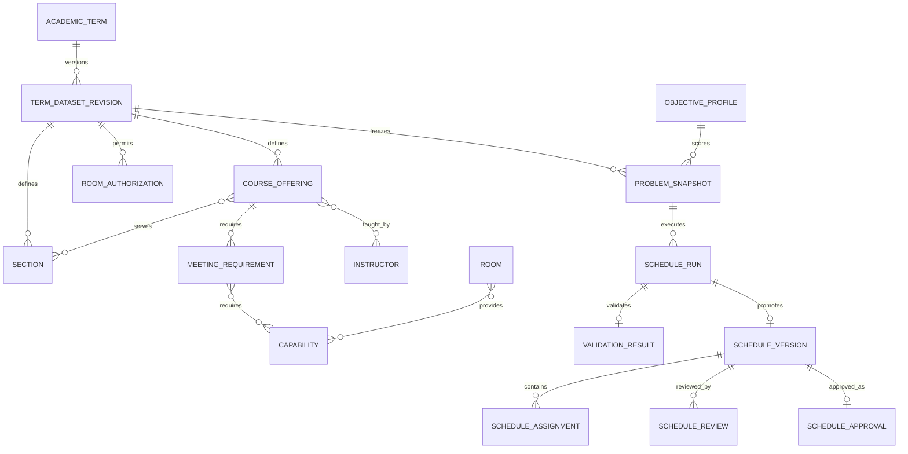

# Data dictionary

This dictionary describes the implemented relational model. Most mutable operational records inherit `created_at` and `updated_at`. Foreign keys protect historical records and cascade only inside a revision-owned or otherwise dependent aggregate.

## Identity and academic organization

| Entity | Purpose and principal fields | Relationships and invariants |
|---|---|---|
| `User` | Authenticated administrator/reviewer; username, name, email, `role`, active/staff flags | Role is `SYSTEM_ADMIN`, `CENTRAL_SCHEDULER`, or `COLLEGE_REVIEWER`. |
| `College` | Academic college; unique `code`, unique `name`, `is_active` | Owns departments, may own rooms, receives room authorizations and reviews. |
| `UserCollegeScope` | Limits a college reviewer to one or more colleges | Unique user/college pair; only college-reviewer users may have scope rows. |
| `Department` | Department within a college; unique `code`, `name`, `is_active` | College/name is unique; protects academic hierarchy. |
| `Program` | Degree program; unique `code`, `name`, curriculum label, active flag | Belongs to a department; department/name is unique. |
| `Subject` | Reusable catalog subject; unique `code`, `title`, description, active flag | Classification deliberately does not live here because a subject can play different curricular roles. |
| `ProgramSubject` | Curriculum-specific meaning of a subject | Unique program/subject/curriculum-version tuple; assigns `MAJOR`, `MINOR`, or `GE` plus authoritative college and optional department. The department must belong to the college. |

## Terms, cohorts, and optional students

| Entity | Purpose and principal fields | Relationships and invariants |
|---|---|---|
| `AcademicTerm` | Semester container; academic year, semester, campus, start/end dates, status | Unique year/semester/campus; end follows start. Status: draft, active, closed, archived. |
| `TermDatasetRevision` | Versioned complete input for a term; revision number, label, status, content hash | Unique number per term and unique nonblank hash per term. Committed/superseded revisions require a hash and are immutable. |
| `Section` | Active scheduling cohort for a revision; code, year level, incoming/continuing/graduating status, expected enrollment | Unique code per revision; year level 1–10; belongs to a program. Expected enrollment is optional for legacy/routine data but, when present, is 1–50 and is mandatory for formal snapshots. Inactive sections do not become solver events. |
| `Student` | Optional pseudonymous learner record; pseudonymous code and status | No name or institutional student number. Not required when section conflict control is sufficient. |
| `StudentSectionMembership` | Optional student-to-section link | Unique student/section pair; supports section membership evidence without making the individual a solver resource. |

Each term can have several draft revisions, but every experiment and schedule references one exact committed revision. A new semester creates a new term/revision rather than overwriting graduating or inactive cohorts.

## Instructors, rooms, capabilities, and time

| Entity | Purpose and principal fields | Relationships and invariants |
|---|---|---|
| `Instructor` | Faculty resource; unique employee code, display name, active flag | Belongs to a department. De-identify codes/names in shared research extracts. |
| `Room` | Unified physical-space inventory; code, name, campus, kind, active flag | Unique campus/code. Kind is classroom, laboratory, or special. Exactly one owner: college or department. No capacity field by design. |
| `LaboratoryProfile` | Optional lab-specific type and notes | One-to-one with a room whose kind is laboratory; it is not a duplicate room record. |
| `Capability` | Required/available feature, such as a computing laboratory | Unique code and name. |
| `RoomCapability` | Room-to-capability bridge | Unique room/capability pair. |
| `RoomAuthorization` | Revision-specific permission to use a room for a curricular classification | Links room, classification, and exactly one college or department. Ownership alone does not grant authorization. |
| `TimeSlot` | Smallest time atom; day, sequence, start/end, break flag, active flag | Belongs to one revision; day/sequence and day/start are unique; weekday 0–6; end follows start. |
| `InstructorAvailabilityProfile` | Completeness and daily-load declaration for one instructor/revision | Unique pair. “Assume fully available” requires named acknowledgement and time. Formal data chooses either a positive maximum daily teaching-atom count or an explicit approved no-limit acknowledgement, never both. |
| `InstructorAvailability` | Availability for one instructor profile/time atom | Unique profile/slot; both use the same revision. |
| `RoomAvailabilityProfile` | Completeness declaration for one room/revision | Unique pair; room campus matches term. Full-availability assumption requires acknowledgement. |
| `RoomAvailability` | Availability for one room profile/time atom | Unique profile/slot; both use the same revision. |
| `InstructorPreference` | Optional preferred/avoid signal and positive weight | Unique profile/slot and same revision. Preference never overrides hard availability. |
| `ReservedTimeBlock` | Approved recurring teaching exclusion; scope, target, label, reason, policy, active flag | Belongs to one revision and targets exactly institution, college, department, program, or section. The policy must be approved for the same term. |
| `ReservedTimeBlockSlot` | Connects one reserved block to an exact weekly time atom | Unique block/slot pair; block and slot share a revision. |

The room design separates **kind**, **capability**, **ownership**, and **authorization**. A laboratory can be owned by one department yet authorized as a shared facility for another unit or classification.

## Semester offerings and meeting demand

| Entity | Purpose and principal fields | Relationships and invariants |
|---|---|---|
| `CourseOffering` | Revision instance of a catalog subject; external key, offering department, active flag | Unique external key per revision; connects to sections/instructors through bridges. |
| `OfferingSection` | Assigns an offering to a section and curriculum row | Offering/section share a revision; curriculum row matches section program and offered subject. |
| `OfferingInstructor` | Assigns one or more instructors to an offering | Unique offering/instructor pair. Every linked instructor occupies meeting atoms. |
| `MeetingRequirement` | One schedulable event; UUID, component, occurrence, duration atoms, distinct-day group | Unique offering/component/occurrence; duration and occurrence are positive. |
| `MeetingRequiredCapability` | Required feature for a meeting | Unique meeting/capability pair; legal placements have every required feature. |

`CourseOffering` is the bridge between catalog data and a semester schedule. `MeetingRequirement` preserves recurrence and duration: a three-hour lab and two one-hour lectures become separate events rather than one ambiguous subject row.

## Import and immutable research inputs

| Entity | Purpose and principal fields | Relationships and invariants |
|---|---|---|
| `ImportBatch` | Staged workbook metadata; filename, SHA-256 file hash, status, totals, summary | Belongs to term/uploader; file hash is unique per term. A committed batch references its committed revision. |
| `ImportError` | Sheet/row/column validation error with stable code/message | Many per batch; supports correction without partial commit. |
| `ConstraintPolicyVersion` | Versioned provenance for one hard or soft rule; code, version, definition, owner, source, effective term, parameters, approval, SHA-256 hash | Unique rule/version/effective-term tuple. Approved versions require an approver/time and become immutable. |
| `ObjectiveProfile` | Versioned soft policy; weights, definitions, normalizers, SHA-256 hash, approval | Unique name/version/term; weights nonnegative. Approved profiles require approver/time and become immutable. |
| `ProblemSnapshot` | Canonical solver input and candidate map with schema/hash | Links one revision and objective profile. New formal snapshots freeze the approved constraint manifest, fixed 50-student rule, unique meeting headcounts, reserved-block evidence, and daily-load evidence. The entire row is immutable and hash is globally unique. |

The fixed 50-student rule is not a room-capacity field. A combined meeting sums
each unique attached section once; 51 or more blocks snapshot creation for every
room type. `Room` deliberately stores no capacity, chairs, or floor area.

Hashes support integrity and exact reruns; they do not anonymize sensitive data.

## Experiments, runs, and validation

| Entity | Purpose and principal fields | Relationships and invariants |
|---|---|---|
| `ExperimentBatch` | Controlled comparison; snapshot, seed list, order seed, time/CPU/memory limits, configuration, status | All child runs use one snapshot; seeds are unique nonnegative integers. |
| `ScheduleRun` | One trial; algorithm, seed, status, config, task ID, timestamps, timing, objective, gap, violations, diagnostics/result/error | Batch/algorithm/seed is unique; timings nonnegative. GA cannot claim `OPTIMAL` or proven `INFEASIBLE`. |
| `ValidationResult` | Independent result for exactly one run or schedule | Feasibility, violations, raw penalty, breakdown, 0–100 quality, validator version/time. Feasible implies zero hard violations. |
| `RunMetric` | Extensible named numeric metric with unit/metadata | Unique metric name per run. |

Statuses distinguish queue/running, feasible/optimal, proven infeasibility, no solution found, timeout, cancellation, and infrastructure failure. Reports must not merge them.

## Timetables, locks, and approval

| Entity | Purpose and principal fields | Relationships and invariants |
|---|---|---|
| `ScheduleVersion` | Named version; term, revision, optional snapshot/run/parent, source, status, objectives, creator/time | Unique version per term and at most one approved version per term. Approved/archived content is immutable. |
| `ScheduleAssignment` | Meeting placement at a room and starting atom | Unique meeting per schedule; references share revision/campus. Expands over full duration. |
| `ScheduleRoomAllocation` | One occupied room/time atom | Unique assignment/atom and schedule/room/atom; database room-conflict guard. |
| `ScheduleInstructorAllocation` | One occupied instructor/time atom | Unique assignment/instructor/atom and schedule/instructor/atom. |
| `ScheduleSectionAllocation` | One occupied section/time atom | Unique assignment/section/atom and schedule/section/atom. |
| `LockedAssignment` | Active hard preassignment; meeting, room, start, actor, reason, source schedule | One active lock per meeting; references share revision/campus; consumed identically by both algorithms. |
| `ScheduleReview` | College comment, change request, or endorsement | Reviewer scope validated; endorsement/change request requires comment; one endorsement per schedule/college. |
| `ScheduleApproval` | Final central approval with actor, time, notes | One-to-one; approver is admin/central scheduler; schedule is independently feasible and approved. |
| `AuditLog` | Append-only actor/action/entity/IP/details event | Indexed by entity, actor, and action; model forbids editing/deletion. |

## Relationship summary

## Retention and research extracts

- Retain records only under an adviser/USM-approved policy.
- Keep workbooks and backups outside Git in access-controlled storage.
- Prefer aggregate sections. If membership is necessary, use generated pseudonymous codes and keep any re-identification key elsewhere.
- De-identify instructor names/codes in shared thesis datasets.
- Preserve hashes, seeds, objective definitions, software versions, and aggregate results needed for reproducibility after approved source records are removed.
