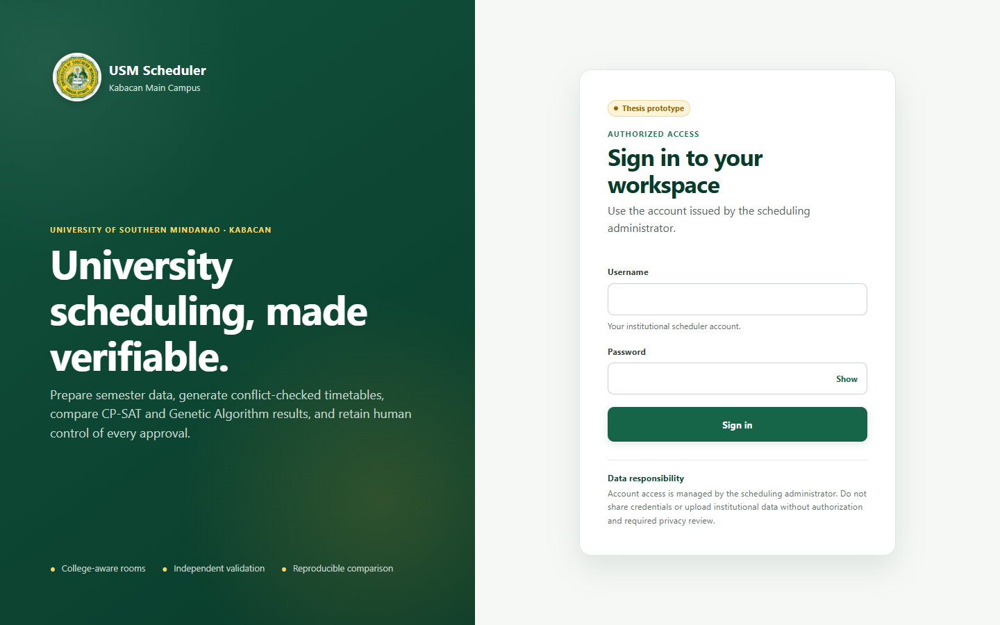
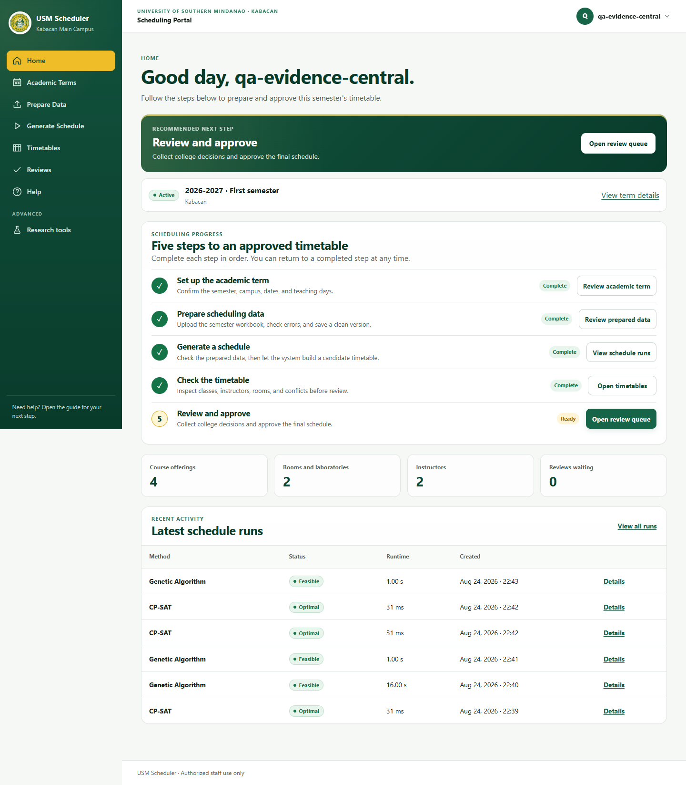
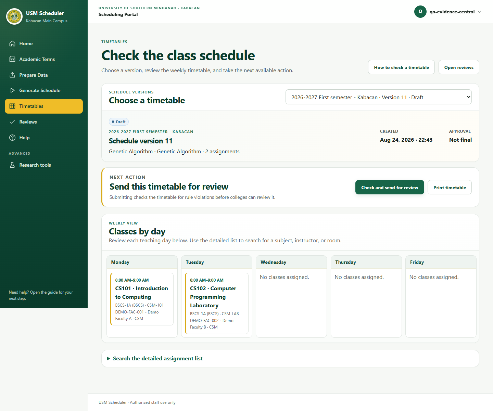
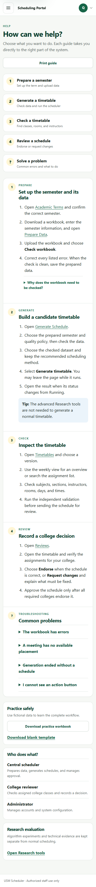

# USM Scheduler thesis validation report

## Release candidate

- Branch: `ui/simplified-workflow`
- UI baseline: `f115a010ae2d64f2d31706bf26144788ba1b29bf`
- Final QA commit: the commit containing this report; record its full hash in the signed thesis evidence copy and participant result sheet.
- Validation date: 28 August 2026
- Scope: thesis-defense readiness for the staff-facing scheduling workflow, not institutional production deployment.
- Data: deterministic synthetic/de-identified workbooks only.

## Environment

Local validation uses Windows, Python 3.12.2, Django's live test server, Playwright 1.62.0, bundled Chromium, and Playwright Firefox. GitHub Actions repeats the suite on Linux with PostgreSQL 18 and Redis 7.4, production security checks, migrations, static collection, coverage, and a container build.

## Automated validation

The final execution results are recorded here after the release-candidate run. A result is not marked passed until the command exits successfully.

| Check | Command/evidence | Result |
|---|---|---|
| Clean dependency consistency | Isolated Python environment, `python -m pip check` | Passed; no broken requirements |
| Python lint | `ruff check .` | Passed |
| Django configuration | `python manage.py check` | Passed; no issues |
| Production security configuration | `python manage.py check --deploy --fail-level WARNING` with production environment values | Passed; no issues |
| Migration drift | `python manage.py makemigrations --check --dry-run` | Passed; no changes detected |
| Static collection | `python manage.py collectstatic --noinput --dry-run` | Passed |
| Complete pytest suite | `pytest --cov=scheduler --cov-report=term-missing --cov-fail-under=70` | **142 passed, 3 diagnostic tests deselected, 87.41% coverage; 4m43s** |
| Chromium browser suite | Included in complete pytest suite | Passed |
| Firefox workflow smoke | `test_firefox_login_navigation_and_principal_workflow_smoke` | Passed |
| WCAG A/AA automation | `test_critical_pages_have_no_automated_wcag_a_or_aa_violations` | Passed; zero detected violations on scanned pages |
| Linux/PostgreSQL/Redis CI | Manually dispatched `CI` workflow for this branch | Pending dispatch |
| Container build | `container` job in the dispatched `CI` workflow | Pending dispatch |

The CI coverage threshold is 70%. Coverage is a regression guard, not a substitute for the permission, workflow, and state-transition assertions below.

## Risk-based browser matrix

The browser suite verifies:

- Central scheduler, college reviewer, and system administrator navigation, account controls, role-specific actions, read-only pages, and direct API denial for reviewer-only access.
- Principal routes at 1440, 1184, 768, 390, and 320 pixels.
- HTTP success, meaningful rendered content, JavaScript console/page errors, viewport-level horizontal overflow, and clipped interactive controls.
- A 105-class timetable, 50 review rows with lengthy comments and institutional labels, and 50 additional long academic-term rows.
- The existing deterministic scaling suite at 25%, 50%, 75%, and 100% demand projections.
- Chromium's full workflow and Firefox login, navigation, generation, timetable, reviews, and Help smoke coverage.

The complete synthetic browser journey exercises an invalid workbook followed by a valid workbook, commit, data check, running and failed run displays, successful CP-SAT generation, draft timetable inspection, submission, changes requested, endorsement, central approval, XLSX/CSV export, print media, and archived rendering.

## Screenshot evidence

The screenshots below were captured from the local release candidate with the reproducible `scripts/capture_validation_screenshots.py` utility and a visibly synthetic `qa-evidence-central` account. The underlying workbook is the repository's deterministic demonstration data.

Additional evidence captures: [Generate Schedule](evidence/ui/generate-1440.png), [Reviews](evidence/ui/reviews-1440.png), and [Help at 1440 pixels](evidence/ui/help-1440.png).

## Accessibility

Automated scans use `axe-playwright-python==0.1.8` against WCAG 2.0/2.1 A and AA plus WCAG 2.2 AA tags on Login, Home, Prepare Data, Generate Schedule, Timetables, Reviews, and Help at desktop and mobile widths. Automated scanning cannot establish full conformance.

The thesis evidence copy must also record these manual checks:

| Manual check | Tester/date | Result | Evidence/notes |
|---|---|---|---|
| Keyboard-only login, navigation drawer, forms, details, tables, timetable, reviews, and sign-out |  | Pending |  |
| Visible focus and logical focus order |  | Pending |  |
| 200% zoom and responsive reflow |  | Pending |  |
| Text/non-text contrast, including focus and status colors |  | Pending |  |
| Loading, success, and error status announcements |  | Pending |  |
| Screen-reader names, headings, landmarks, form instructions, and table captions |  | Pending |  |
| Reduced-motion preference |  | Pending |  |
| Print output for approved timetable and Help |  | Pending |  |

Release acceptance requires zero unresolved automated A/AA violations and no blocker in the manual checks.

## Usability validation

Participant testing cannot be simulated by an automated agent. The approved study team must run the sessions using [the usability validation kit](usability-test-kit.md) and store task observations in a protected copy of [the results template](usability-results-template.csv).

| Measure | Acceptance rule | Current result |
|---|---|---|
| Participants | 3–5 representative users, IDs only (`U01`–`U05`) | Pending field sessions |
| Critical task completion | Every task succeeds for all but at most one participant | Pending field sessions |
| Blockers | None unresolved | Pending field sessions |
| Permission misunderstandings | All fixed and re-tested | Pending field sessions |
| Repeated issues | Fix issues observed by two or more participants | Pending field sessions |

No participant outcome, completion time, quotation, or acceptance claim is fabricated in this report. Aggregate de-identified findings should replace the pending cells only after the approved sessions.

## Defects and limitations

- The focused automated cycle found no unresolved application UI, permission, overflow, browser-console, or automated WCAG A/AA defect. No additional broad visual changes were made.
- WebKit/Safari is outside the thesis browser target.
- Automated axe results cover detectable rules only; the manual checks and participant study remain necessary.
- Local SQLite evidence is supplemented by, not equivalent to, the dispatched Linux/PostgreSQL/Redis CI run.
- Thesis results apply to the tested synthetic/approved datasets and roles; they do not establish institution-wide production readiness.

## Acceptance decision

The branch is technically eligible for thesis evaluation only after all automated checks and the manually dispatched CI workflow pass. Final thesis-validation acceptance remains pending until the manual accessibility checklist and approved 3–5 participant usability sessions satisfy the rules above.
